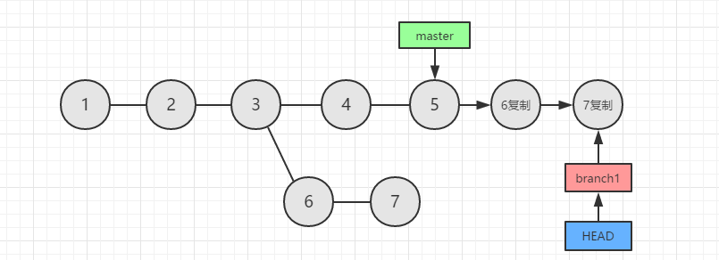
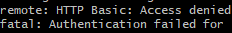

# git项目管理总结

### 开发中的运用

一般的在多人开发的过程中，一开机我们开始需要先git pull拉取一下远程的代码，再进行编写

当我们一顿操作写完代码之后

#### 基本操作

```
//先查看一下我们的修改的代码的文件，是否是正确
git status
//下面将想要提交的文件add一遍，下面的 ‘.‘ 表示修改的所有文件，当然你也可以一个一个的add，看一下上一步的路径将 ’.‘ 替换为对应的路径就好了
git add .
//再查看一下状态，是否是预期add的文件，一般的我都会去vscode再次确认自己所修改的东西是否正确，会不会有什么测试代码没去除的
git status
//下边将代码保存到本地，下面的注释可能大家的规范也不太一致，我是用fix代表的修复bug，只举个例子，注释清晰，才好复查每个提交的记录
git commit -m "fix：修复什么什么"
//拉取一下远程代码，有冲突则解决冲突
git pull
（如果有冲突解决冲突保存文件之后要再add一次和commit一次）：git add .   ---->   git commit -m "chore:解决冲突"
//上传到远程仓库
git push
```


#### 合并分支

```
//先查看一下远程分支
git branch -r
//先切换分支到想要合并的目标分支(在上一步复制一下目标分支名)
git checkout 分支名
//拉去一下最新的代码
git pull
//如果是将目标分支合并到自己的开发分支,这时就需要切回自己的开发分支了
git checkout 分支名
//合并目标分支
git merge 分支名
//然后此时会弹出合并注释输入英文 :wq 然后回车
//如果有冲突,则解决冲突跟上面的基本操作一样解决冲突然后保存再add一次然后commit
//最后一步如果需要提交到远程的话
git push
```


#### 如果再修改着一个bug还没修完,但是你需要去处理另外一个紧急的bug,此时你改的东西还不想commit

解决方法:

```
//将代码暂存再栈里面
git stash save "注释"
//此时你会发现修改的代码的文件全没了,不用担心,只是存起来了,执行下面命令行查看是否真的存在栈里面
git stash list
//此时你就可以切换分支去修改你的紧急的bug了
//然后修改完后你想继续修改原来的bug了,先查看栈信息,查看一下自己的是存在哪个索引里(因为可能你同事也存了)
git stash list 
//下面分两种情况:
//1.(如果只有你自己一个存了) 直接  git stash pop     //恢复到工作区
git stash pop
//2.(如果出现多条,还有其他同事存了),那么就要看看你的是存再哪个索引里,下面我以再索引 0 为例子 //恢复到工作区
git stash pop stash@{0}
//上面恢复到工作区后,就就又可以看到你之前修改的代码了
//下面,如果你不想要了,想再重新写也行,但是你要清理一下你存的那个信息,下面选一个
git stash drop [stash_id] 删除一个存储的进度，如果不指定stash_id，则默认删除最新的存储进度
git stash clear 删除所有栈
```

#### 版本回滚和回退

回退： reset      //回退到某次提交，然后某次提交之后的都会没掉

回滚： revert   //撤销中间的某一次的提交，某次提交之后的提交还会存在

版本回退在开发中都是一件比较慎重的事，除非还没提交到远程的，不到万不得已的情况下我们一般不怎么想回退

碰到有以下几种情况：

在多人开发中，我们一般都会分需求开发，然后再合并到同一个分支上

##### 1.如果只是在自己的开发分支，可以使用reset回退或者revert回滚版本

```
revert：
//我们先查看当前分支提交日志
git log
//通过提交日志，我们可以找到对应的提交记录的commit_id,然后执行revert撤销掉那个commit_id的提交
git revert commit_id
//如果你想取消这次 revert 可以执行 取消回滚:   git revert --abort
//最后一步 
git push

reset:
//同上，查看当前分支提交日志
git log
//然后找到对应的commit_id，回退到对应的commit_id的提交
git reset --hard commit_id
//最后一步 
git push
```


##### 2.如果你回退 / 回滚的是合并的记录，那么这里就需要注意了

```
revert：（慎重使用revert撤回合并记录）
//我们先查看当前分支提交日志
git log
//通过提交日志，我们可以找到对应的提交记录的commit_id,然后执行revert撤销掉那个commit_id的提交
//！！！注意：那么如果你后面在次合并，但这次修改涉及到上次回退涉及到的代码时，再次合并那部分代码即使再合并过来也不会复现，如果需要拿回之前部分的代码，并进行合并那么则需要revert上一次的回滚了
git revert commit_id
//如果你想取消这次 revert 可以执行 取消回滚:   git revert --abort
//最后一步 
git push


reset:
//同上，查看当前分支提交日志
git log
//然后找到对应的commit_id，回退到对应的commit_id的提交
git reset --hard commit_id
//最后一步 
git push
//如果你回退的那次提交后面还有同事合并过，那么你就需要通知一下你的同事，叫他们再合并过来一次
```


#### cherry-pick将指定某次或者某几次提交提交到某个分支------修复某些bug，如果你有一些什么其他私有化的项目分支也需要修复

可以使用cherry-pick

```
//首先还是地查看提交日志
git log --all   //查看所有分支的历史

对于多分支的代码库，将特定的几个提交移到另一个分支是常见需求
git cherry-pick <commitHash> 将指定的提交commitHash，应用于当前分支
git cherry-pick feature 表示将feature分支的最近一次提交，转移到当前分支
git cherry-pick <HashA> <HashB> 转移多个commit到当前分支
git cherry-pick A..B 转移从 A 到 B 的所有提交. 注意不包含提交 A 如果要包含提交 A使用git cherry-pick A^..B

（想回到 cherry-pick 之前，那么可以使用 git cherry-pick --abort ）
```


#### rabase变基

（变基在很多分支开发的情况下，可以用于多分支开发提交变成一条直线的提交，方便查看）

```
git rebase 分支名
```

下面以master为例子：

git rebase master




#### git从某个提交检出新分支

从某一个commit开始创建本地分支 

1、git log 查看提交

2、通过checkout 跟上commitId 即可创建制定commit之前的本地分支 

git checkout commitId -b 本地新branchName 

上传到远程服务器 

依然通过push 跟上你希望的远程新分支名字即可 

git push origin HEAD:远程新branchName 


#### 解决git pull/push每次都需要输入密码问题

\1. git bash进入你的项目目录，输入：

\2. git config --global credential.helper store

然后你会在你本地生成一个文本，上边记录你的账号和密码。当然这些你可以不用关心。

然后你使用上述的命令配置好之后，再操作一次git pull，然后它会提示你输入账号密码，这一次之后就不需要再次输入密码了

#### 切换远程仓库

###### 如果A是已有仓库，B是新建立的空仓库。

1、在本地拉一下（git clone）A仓库的代码，或者是git pull 下最新的代码。

2、git remote? ?# 查看本地连接的有哪些 远程仓库，默认是 origin

3、git remote add origin2(这个名字随便起) master? ?#?这里是在本地添加一个新的远程连接

4、git remote set-url origin2 B仓库的地址? ?#?这里是新加个远程连接 设置上url地址

5、在A的本地仓库? git push origin2 dev:master? ?#?origin2 是你想push上哪个远程库，dev 是你想push哪个分支，master 是push到远程的哪个分支。? ? 这个命令执行以后要输密码，记得是新仓库的密码。


###### 远程仓库已经存在master分支

远程master的代码是无用的并且可以使用强推

//添加仓库

git remote add origin <仓库地址>

//强制push本地master分支到远端的master分支

git push origin master:master -f


###### 远程仓库未创建分支

//添加仓库

git remote add origin <仓库地址>

//push本地master分支新建远端master分支

git push origin master:master


---另一个方法：使用镜像（还没使用过）

git push --mirror http://...(目标仓库地址)


### 查看git账号名及邮箱

```
git config user.name
git config user.email
```


### 修改全局配置git 账号及邮箱

```
git config --global user.name "账号名"
git config --global user.email "邮箱名"
```


### 配置局部git账号

```
git config user.name "账号名"
git config user.email "邮箱名"
```


#### 如果开始输入密码错误

remote: HTTP Basic: Access denied

fatal: Authentication failed for 'http://********



解决方案：

git config --system --unset credential.helper

之后再进行git操作时，弹出用户名密码窗口，输入即可


### 查看分支历史（提交日志）

```
查看所有分支的历史 git log --all   图形化查看 git log --all --graph

查看当前分支的历史 git log

​	查看当前分支历史-简洁 git log --oneline

​	查看所有分支历史-简洁 git log --oneline --all

​	查看所有分支历史的近几个历史（此处4个） git log --oneline --all -n4

查看某个文件的历史  git log --all --full-history -- package-lock.json    //例如package-lock.json文件
```


### 查看分支

```
查看所有本地分支 git branch
查看远程所有分支 git branch -r
查看所有分支 git branch --all 
```


### 创建本地分支

```
git branch 分支名
```

#### 创建分支并切换到该分支 

```
git checkout -b 分支名
```


#### 在创建新的分支进行提交代码

我们新建分支的时候，不能直接git push上去，只能通过下面这样

```
git push --set-upstream origin  分支名
```

### 删除分支 

git push origin :dev  # 删除远程dev分支，危险命令哦

\# 下面两条是删除本地分支

git checkout master  # 切换到master分支

git branch -d dev  # 删除本地dev分支


### add添加到git管理暂存区 

```
git add 文件名
git add .   //暂存所有修改的文件到暂存区
```


### status查看git管理文件状态

```
git status
```


### fetch更新远程分支列表

一般我用的git fetch 比较多

```
git fetch
git remote update origin --prune
git remote update origin -p
```


### pull拉取远程代码

```
git pull
```


#### git pull 和 git fetch的区别

git pull表示拉取更新本地的远程的分支，并拉取到最新的代码到本地，而git fetch只是拉取远程的分支跟新本地远程的分支


### commit暂存更改

```
git commit -m "注释"
```

清理暂存区的更改 

```
git reset --hard
```


#### 修改最后一次注释

git commit --amend

出现有注释的界面（你的注释应该显示在第一行）， 输入i进入修改模式，修改好注释后，按Esc键 退出编辑模式，输入:wq保存并退出。


### diff对比两个commit之间的差异

git diff <commit_id_1> <commit_id_2>


### push提交本地分支到远程

```
git push

git push origin 本地分支名:远程分支名（最好远程分支与本地分支同名）
```


### revert回滚

```
git revert commit_id 可以撤销某个commit提交，撤销会产生一个新的提交

//取消回滚
git revert --abort
```


### reset回退

```
git reset --hard commitId
```


### stash暂存入队列栈

```
git stash(场景：不想提交当前本地修改，但需要切分支修bug)
1.git stash 保存当前分支内容 入信息栈
2.git stash save "注释"  //添加注释
2.git stash list  //显示保存进度的列表
3.git stash pop //恢复最新的进度到工作区
4.git stash pop stash@{1} //恢复指定进度到工作区。stash_id是通过git stash list命令得到的
5.git stash apply //除了不删除恢复的进度之外，其余的git stash pop命令一样
6.git stash drop [stash_id] 删除一个存储的进度，如果不指定stash_id，则默认删除最新的存储进度
7.git stash clear 删除所有栈
```


### cherry-pick

```
cherry-pick（场景：指定某几次提交到某个分支）
对于多分支的代码库，将特定的几个提交移到另一个分支是常见需求
git cherry-pick <commitHash> 将指定的提交commitHash，应用于当前分支
git cherry-pick feature 表示将feature分支的最近一次提交，转移到当前分支
git cherry-pick <HashA> <HashB> 转移多个commit
git cherry-pick A..B 转移从 A 到 B 的所有提交. 注意不包含提交 A 如果要包含提交 A使用git cherry-pick A^..B

（想回到 cherry-pick 之前，那么可以使用 git cherry-pick --abort ）
```


### rabase变基

（变基在很多分支开发的情况下，可以用于多分支开发提交变成一条直线的提交，方便查看）	

git rebase master

