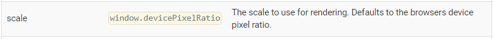
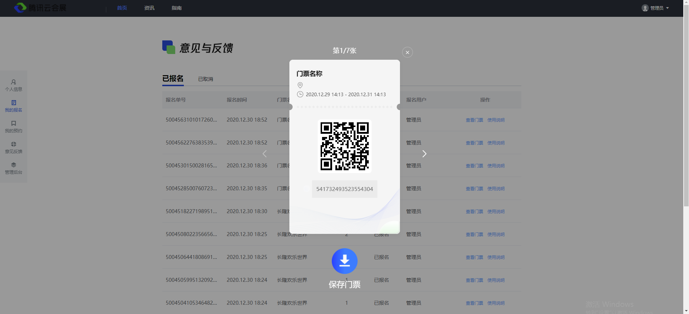

# pc、h5项目踩坑

## **html2canvas插件的使用-----分享海报绘制功能**

安装依赖：

```
npm install --save html2canvas
```


html:

```html
<div id="posters">
    dom画布内容
</div>
```

js

```javascript
<script>
import html2canvas from 'html2canvas';

data:{
  return {
      canvasImg: ""
  }  
},

methods:{
    loadingPosters() {
                if (this.canvasImg) {
                    return
                }
                //解决截图不全问题
                window.pageYoffset = 0;
               document.documentElement.scrollTop = 0;
               document.body.scrollTop = 0;
               //截图方法调用
               html2canvas(document.getElementById('posters'), {
                        width: document.getElementById('posters').offsetWidth,   //获取dom的宽度
                        height: document.getElementById('posters').offsetHeight,    //获取dom的高度
                        useCORS: true,    //允许跨域，重点：需要后端配置图片url跨域!!!,否则拿接口的图片url会出现跨域问题导致无法显示
                        logging: true,    //启用日志以进行调试,查看html2canvas的内部执行流程
                        scrollY: 0,       //解决偏移问题
                        scrollX: 0,      //解决偏移问题
                        backgroundColor: null     //背景颜色为null为透明（默认是白色，可能海报会留白边的情况）
                    })
                    .then(canvas => {
                        var pageData = canvas.toDataURL('image/jpeg', 1.0);    //生成一个base64的图片
                        this.canvasImg = pageData    
                    })
            },
}
</script>
```

## 踩坑：

### 1.截图不全问题：

如果出现截图不全的问题，可以试一下在调用html2canvas方法截图之前，将滚动条置顶

```javascript
window.pageYoffset = 0;                
document.documentElement.scrollTop = 0;                
document.body.scrollTop = 0;
```

### 2.配置属性以及属性对应属性解决的相关问题：

```javascript
html2canvas(dom, {  
width: dom.offsetWidth, //dom的宽度 
height:dom.offsetHeight, //dom的高度 
useCORS: true,    //允许跨域，重点：需要后端配置图片url允许跨域!!!,否则拿接口的图片url会出现跨域问题导致无法显示
logging: true,    //启用日志以进行调试,查看html2canvas的内部执行流程                         
scrollY: 0, //解决截图偏移问题   
scrollX: 0, //解决截图偏移问题 
backgroundColor: null     //背景颜色为null为透明（默认是白色，如果绘制出来留白边的情况，可以试一下配置一下这个）                 
}).then(canvas => {                         
var pageData = canvas.toDataURL('image/jpeg', 1.0);        
})
```

### 3.dom过长截图不全的问题

在你的**分享海报比较长的时候**，就要注意了（比较短的就无需理会），**试过海报长度有上1000px**的将绘制的方法放在nextTick上执行也还是会出现截图不全的情况，需要将**该绘制方法放在一个定时器中**绘制，在下一个宏任务执行（**可能是因为dom太长，还没渲染完毕就执行的绘制的方法，导致截图不全的情况**）

**另一个解决方案是**：先显示dom给用户看，当用户先下载图片的时候，才使用html2canvas生成图片

### 4.文本省略

**html2canvas使用text-overflow：ellipsis实现文本省略是不生效的**，如果需要实现省略功能只能通过js实现------通过计算限定文本不可超过的高度，然后通过js手动截取文字在末尾添加省略号（...）

解决方案：使用js解决

```javascript
// el 对应文本的dom对象
//height 高度 =  文本的行高 * 需要显示的行数
overflowHiddon(el,height) {     
  var s = el.textContent || el.innerText;     
  var n = el.offsetHeight;     
  for (var i = 1; i <= s.length; i++) {        
    el.innerHTML = s.substr(0, i);        
    if (height < el.scrollHeight) {           
        el.style.overflow = 'hidden';           
        el.innerHTML = s.substr(0, i - 3) + '...';           
        break;       
    }                         
 }           
}
```

使用：

html:

```html
<div id="posters-title" class="posters-title">{{ postersData.title }}</div>
```

js:

```javascript
this.$nextTick(_=>{
    var text = document.getElementsByClassName('posters-title');
     for (var i = 0; i < text.length; i++) {
          this.overflowHiddon(text[i]，40 * 2);
     }
})

//height为文字的行高
overflowHiddon(el,height) {
    var s = el.textContent || el.innerText;
    var n = el.offsetHeight;
    for (var i = 1; i <= s.length; i++) {
       el.innerHTML = s.substr(0, i);
       if (height < el.scrollHeight) {
          el.style.overflow = 'hidden';
          el.innerHTML = s.substr(0, i - 3) + '...';
          break;
      }
                    
   }          
},
```

### 5.省略号边框的绘制


**html2canvas不兼容省略号的边框（生成的图片的省略号边框会是一条实线）：**

解决方案：使用在想要加省略号边框的元素使用伪元素，伪元素的content内容为●●●●(这个点是输入法的，在符号中找，不然键盘的那个点太小了使用font-size调大会出现行高很大，那个点很小的情况)，这个点输入尽可能多，给一下width：100%和overflow：hidden就好了，然后再设置一下字体间距css的letter-spacing，设置一下字体颜色，那就可以实现虚线的效果了。然后给一下行高和使用绝对定位和transform定位到你想要的位置即可


### 7.截图模糊问题

**html2canvas有一个scale属性**，这个属性的默认值的是window.devicePixelRatio（设备像素比），下面是我去文档截的图



如果你所要绘制的图片相对于浏览器是比较小的话，很可能生成的像素并不是很高，例如下面这张图




像这张图生成出来后，我发送到手机上看是相对比较模糊的，因为手机上点预览会是放大到手机屏幕的最大宽度，所以图片可能会被放大，那么这张图的像素不够的话显然是会出现模糊的情况的

**解决方案：**

所以我们在使用html2canvas截图的时候我们将scale这个属性设置为2，将他的像素放大两倍，那么就可以解决截图模糊的问题了（如果还是模糊可以试试再调大一点）


### 分享也当然少不了下载功能和复制链接功能了

**复制链接方法**

```javascript
copyLink() {
     let copyLink = document.getElementById('copyLink')
     copyLink.value = window.location.href
     copyLink.select()
     try {
       document.execCommand('copy');
       console.log("复制成功")
     } catch (e) {
      console.log("复制失败")
    }
},
```


移动端无法下载base64的图片需要转换类型再下载

base64转blob类型

```javascript
base64ToBlob(downLoad, base64Img) {
                var blob = getBlob(base64Img);
                console.log(blob)
                downLoad.setAttribute('href', URL.createObjectURL(blob));

                function getBlob(base64) {
                    console.log(getContentType(base64))
                    return b64toBlob(getData(base64), getContentType(base64));
                }

                function getContentType(base64) {
                    return /data:([^;]*);/i.exec(base64)[1];
                }

                function getData(base64) {
                    return base64.substr(base64.indexOf("base64,") + 7, base64.length);
                }

                function b64toBlob(b64Data, contentType, sliceSize) {
                    contentType = contentType || '';
                    sliceSize = sliceSize || 512;

                    var byteCharacters = atob(b64Data);
                    var byteArrays = [];

                    for (var offset = 0; offset < byteCharacters.length; offset += sliceSize) {
                        var slice = byteCharacters.slice(offset, offset + sliceSize);

                        var byteNumbers = new Array(slice.length);
                        for (var i = 0; i < slice.length; i++) {
                            byteNumbers[i] = slice.charCodeAt(i);
                        }

                        var byteArray = new Uint8Array(byteNumbers);

                        byteArrays.push(byteArray);
                    }

                    var blob = new Blob(byteArrays, {
                        type: contentType
                    });
                    return blob;
                }
},
```


但是下载**blob类型**手机系统浏览器下载出现兼容问题，有的手机下载后是无法打开的，所以这里需要**后端上传接口返回一个下载链接，通过a标签的download属性进行下载**


## **文件、图片下载**

### **1. 下载使用接口返回流的形式下载**

**问题原因：**下载是通过请求接口，接口返回流的形式实现。接口报错，因此下载失败。

**解决方案：**解决接口报错问题；使用a标签的download属性下载，但要注意href地址不能跨域，跨域download属性会失效，而文件地址是存放在cos的，因此要把文件放到项目服务器下或者是使用nginx配置转发规则指向cos地址


### **2. 如果没有使用接口返回流的形式下载文件**

**pc端**：使用a标签的download属性下载没有问题，但下载的文件附件、图片需要返回的链接是下载的链接而不是预览链接


**h5端**: 使用下载的方法有以下两种

**1. iframe实现下载（ios不支持iframe）**

```javascript
//在h5中ios不兼容iframe
function downloadFile(){
    var src = file.fileUrl;
    var iframe = document.createElement('iframe');
    iframe.style.display = 'none';
    iframe.src = "javascript: '<script>location.href=\"" + src + "\"<\/script>'";
    document.getElementsByTagName('body')[0].appendChild(iframe);
}
```

**2. a标签的download属性下载**

```javascript
//如果使用遍历，a标签只会弹出最后一个
function downloadFile(){
    let title = file.fileName + '.' + file.fileType
    var linkDom = document.createElement('a')
    linkDom.setAttribute('href', file.fileUrl)
    linkDom.setAttribute('download', title)
    document.body.appendChild(linkDom)
    setTimeout(() => {
      linkDom.click()
      document.body.removeChild(linkDom)
    }, 60)
}
```


### **批量下载**

其中有一个需求是实现批量下载，没有使用流的形式，这里只能是使用遍历模拟批量下载，但是由于手机浏览器在下载之前是需要点击确认后才能下载的，确认后会出现跳转到浏览器下载的页面，然后返回接着点击下一个下载的文件的弹窗

**！！！最后考虑到ios兼容性的问题，还是需要服务端返回一个压缩包下载比较好**


**模拟批量下载（交互不太好）：**

遍历iframe实现下载的方法是可以实现以上的需求，但是ios不兼容

遍历a标签的download属性，发现只能弹出最后一个a标签的下载弹出，并不能实现像上面的那种模拟遍历的下载

**当下载的文件是图片**

当下载的文件是图片的格式的时候，试过iframe的下载方式是不能用的，后来用的a标签的download属性下载

**！！！注意**：图片的链接的安全证书要保证没有过期，如果过期了，那么手机浏览器下载图片会出现下载失败的情况（uc浏览器除外）


### 在h5中判断手机系统

```javascript
  var u = navigator.userAgent;
  var isAndroid = u.indexOf('Android') > -1 || u.indexOf('Adr') > -1; //android终端
  var isiOS = !!u.match(/\(i[^;]+;( U;)? CPU.+Mac OS X/); //ios终端
```


## vue中使用qrcodejs2插件生成二维码

安装qrcodejs2插件

```javascript
npm install qrcodejs2 --save
```


页面中引入

```javascript
import QRCode from 'qrcodejs2'
```


在对应的Html页面中，添加html标签

```javascript
<div id="qrcode" ref="qrcode"></div>
```


配置，在methods方法里配置

```javascript
qrcode () {
    let $qrcode = document.getElementById('qrcode')
    let qrcode = new QRCode('qrcode',{
        width: $qrcode.offsetWidth, // 设置宽度，单位像素
        height: $qrcode.offsetHeight, // 设置高度，单位像素
        text: 'https://www.baidu.com'   // 设置二维码内容或跳转地址
    })
}
```


调用

```javascript
this.$nextTick(() => {
    this.qrcode()
})
```


## 移动端适配方式

使用插件amfe-flexible，font-size的根元素大小由设计稿决定，如果ui设计稿按照375的宽度为标准，那么font-size的根元素大小为37.5

由上面插件计算出屏幕适配的font-size的大小

通过postcss-pxtorem插件进行全局转换成rem进行移动端的适配


px单位的像素 /  根元素font-size = 适配的比例

适配的px = 适配比例 * 当前根元素的font-size

```javascript
npm install postcss-pxtorem --save-dev
npm install amfe-flexible --save
```


### 1.在Vue 的main.js中引入amfe-flexible

```javascript
import  'amfe-flexible';
```


### 2.在.postcssrc.js 中配置，vue-cli3.0 的版本在postcss.config.js中配置。

```javascript
module.exports = {
  "plugins": {
    'autoprefixer': {
      browsers: ['Android >= 4.0', 'iOS >= 7']
    },
    'postcss-pxtorem': {
      rootValue: 37.5,
      propList: ['*']
    }
  }
}
```


//当前页面的根字体大小

```javascript
document.documentElement.clientWidth / 10    //当前页面的根字体大小
```


## 手机浏览器调试----手机的浏览器会有一个console 按钮

```javascript
<script type="text/javascript" src="https://cdn.bootcss.com/vConsole/3.3.0/vconsole.min.js"></script>
 
<script>
    // 初始化
    var vConsole = new VConsole();
    console.log('Hello world');
</script>
```


## h5调用手机拨号发短信功能

```html
<head>里面加上：<meta name="format-detection" content="telephone=yes"/>
需要拨打电话的地方：<a href="tel:400-0000-688">400-0000-688</a>
发短信：<a href="sms:18688888888">发短信</a>
```

