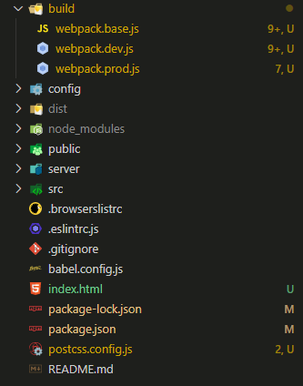

# webpack4+vue-cli3

#### 先使用vue-cli3创建vue项目

#### 1.然后外层文件夹创建index.html文件(里面创建一个以app为id的div标签)，创建build文件夹，dist文件夹

文件目录：



#### 2.安装依赖

1. ##### 安装 webpack 四件套

   ```javascript
   npm i webpack webpack-cli webpack-dev-server webpack-merge --save-dev
   ```

2. ##### html 解析也属于基本配置     ----webpack.base.js

   ```javascript
   npm i html-webpack-plugin --save-dev
   ```

3. ##### 引入vue-loader

4. ##### 安装css loader 预处理器    后处理器

   ```javascript
   npm i css-loader style-loader --save-dev   //css基础loader
   npm i less less-loader --save-dev      //css预处理
   npm i node-sass sass-loader --save-dev      //css预处理 这里sass如果用npm安装失败就使用cnpm安装
   npm i postcss-loader autoprefixer --save-dev   //css后处理
   ```

5. ##### 安装解析图片，字体等都是用 file-loader

   ```javascript
   npm i file-loader --save-dev
   ```

   

6. ##### 优化

- 解决每次重新打包，dist文件夹文件未清除

```javascript
npm install --save-dev clean-webpack-plugin 
```

- 分离 CSS

```javascript
npm install --save-dev mini-css-extract-plugin
```

- 图片压缩

```javascript
npm install --save-dev image-webpack-loader
```

- CSS压缩

```javascript
npm install --save-dev optimize-css-assets-webpack-plugin
```

#### 3.创建 postcss.config.js 文件

```javascript
// postcss.config.js
// 自动添加css兼容属性
// 需要配置这个插件信息
module.exports = {
    plugins: [
        require('autoprefixer')({
            overrideBrowserslist: [
                "Android 4.1",
                "iOS 7.1",
                "Chrome > 31",
                "ff > 31",
                "ie >= 8"
            ]
        })
    ]
};
```

#### 4.webpack.base.js

```javascript
// webpack.base.js 
// 存放 dev 和 prod 通用配置 
const webpack = require('webpack'); 
const resolve = dir => path.join(__dirname, '..',dir);    //定义配置别名方法
const VueLoaderPlugin = require('vue-loader/lib/plugin');  //***** 2.3 ***** vue-loader 插件  这里vue-cli中已经安装vue-loader vue-template-compiler，如果没有，运行命令安装： npm i vue-loader vue-template-compiler --save-dev
const HtmlWebpackPlugin = require('html-webpack-plugin'); //***** 2.2 ******  html 解析也属于基本配置
const path = require("path"); 
module.exports = { 
    entry: './src/main.js', //入口,
    resolve: {
        // 设置别名
        alias: {
            '@': resolve('src')// 这样配置后 @ 可以指向 src 目录
        }
    }, 
    module: { 
        rules: [
          {    //配置vue文件    ***** 2.3 ****
             test: /\.vue$/,
             loader: 'vue-loader'
          },
          {   //配置 css预处理sass   **** 2.4 *****
            test: /\.(sa|sc|c)ss$/,
            use: [
              'style-loader',
              'css-loader',
              //'postcss-loader',
              'sass-loader',
            ],
          },
          {  //配置 css预处理less   ****** 2.4 ******
            test: /\.less$/,
            use: [
              'style-loader',
              'css-loader',
             // 'postcss-loader',
              'less-loader',
            ],
          },
          {  //图片配置及输出处理  ****** 2.5 ******   vue里面img应用静态图片需要引入不能直接赋予绝对路径 import imgUrl from '../assets/logo.png'   通过 :src 绑定引入的变量imgUrl
            test: /\.(png|jpe?g|gif)$/i,
            loader: 'file-loader',
            options: {
               limit: 5000,
               name: '[path][name].[ext]',  //这里将图片都打包到img文件夹
               publicPath: '/',    
            },
          },
        ] 
    }, 
    plugins: [ // 插件
    // 解决vender后面的hash每次都改变 
     new webpack.HashedModuleIdsPlugin(),
    
    //html 解析也属于基本配置***** 2.2 ******
     new HtmlWebpackPlugin({
      template: path.resolve(__dirname, '../index.html'),
    }),
    
    //***** 3 ***** vue-loader
    new VueLoaderPlugin(),
   ], 
};
```

#### 5.webpack.dev.js

```javascript
// webpack.dev.js
// 存放 dev 配置
const {merge} = require('webpack-merge');
const common = require('./webpack.base.js');
const path = require('path');

module.exports = merge(common, {
  devtool: 'inline-source-map',
  devServer: { // 开发服务器
    contentBase: '../dist'
  },
  output: { // 输出
    filename: 'js/[name].[hash].js', // 每次保存 hash 都变化
    path: path.resolve(__dirname, '../dist')
  },
  module: {},
  mode: 'development',
});
```

#### 6.webpack.prod.js

```javascript
// webpack.prod.js
// 存放 prod 配置
const path = require('path');
// 合并配置文件
const {merge} = require('webpack-merge');
const common = require('./webpack.base.js');
const {CleanWebpackPlugin} = require('clean-webpack-plugin')    //***** 2.6.1 **** 
const MiniCssExtractPlugin = require('mini-css-extract-plugin');    // ***** 2.6.2 ******
const OptimizeCSSAssetsPlugin = require('optimize-css-assets-webpack-plugin')   //***** 2.6.4 *****

module.exports = merge(common, {
  module: {
       rules: [
            {
                test: /\.vue$/,
                loader: "vue-loader",
            },
            
            // css loader中的style-loader 替换为 MiniCssExtractPlugin
            {
                test: /\.(sa|sc|c)ss$/,
                use: [
                    MiniCssExtractPlugin.loader,    // ****** 2.6.2 *****
                    "css-loader",
                    // "postcss-loader",
                    "sass-loader",
                ],
            },
            {
                test: /\.less$/,
                use: [
                    MiniCssExtractPlugin.loader,    // ****** 2.6.2 *****
                    "css-loader",
                    // "postcss-loader",
                    "less-loader",
                ],
            },

            {
                test: /\.(png|jpe?g|gif)$/i,
                use: [
                    {
                        loader: "file-loader",
                        options: {
                            limit: 5000,
                            name: "[path][name].[ext]",
                            publicPath: "/",
                        },
                    },
                    //图片压缩   ***** 2.6.3 *****
                    {
                      loader: 'image-webpack-loader',
                      options: {
                        mozJpeg:{
                          progressive: true,
                          quality: 65
                        },
                        optipng:{
                          enabled: false
                        },
                        pngquant:{
                          quality: '65-90',
                          speed: 4
                        },
                        gifsicle: {
                          interlaced: false
                        }
                      }
                    }
                ],
            },
        ],
  },
  plugins: [
    // 解决每次重新打包，dist文件夹文件未清除  ***** 2.6.1 **** 
    new CleanWebpackPlugin()
    //分离 CSS   ****** 2.6.2 *****
    new MiniCssExtractPlugin({   
      filename: 'css/[name].[hash].css',
      chunkFilename: 'css/[id].[hash].css'
    }),
    //CSS压缩 ***** 2.6.4 *****
    new OptimizeCSSAssetsPlugin()
  ],
  mode: 'production',
  output: {
    filename: 'js/[name].[contenthash].js', //contenthash 若文件内容无变化，则contenthash 名称不变
    path: path.resolve(__dirname, '../dist')
  },
});
```

#### 7.创建 npm 命令

```javascript
"scripts": {
  "dev": "webpack-dev-server --hot --open --config build/webpack.dev.js",
  "build": "webpack --config build/webpack.prod.js"
},
```

其中dev中的--hot为热更新

启动项目： npm run dev