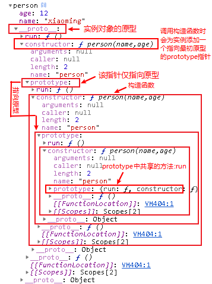
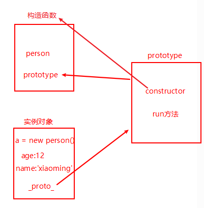
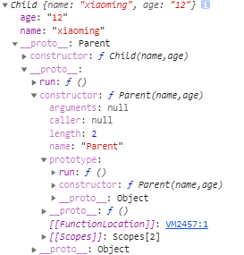
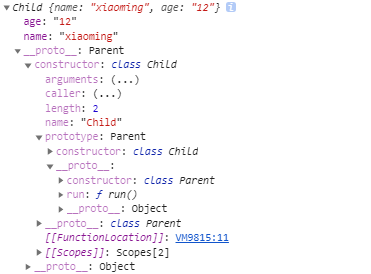

---

typora-copy-images-to: image

---

# 前端js基础

### 基本类型

boolean、null、undefined、number、string、symbol

首先原始类型存储的都是值，是没有函数可以调用的，比如 undefined.toString()    

//Uncaught TypeError: Cannot read property 'toString' of undefined at <anonymous>:1:11


数参数是对象

```javascript
function test(person) {
  person.age = 26
  person = {
    name: "yyy",
    age: 30
  }
 
  return person
}
const p1 = {
  name: "xxx",
  age: 25
}
const p2 = test(p1)
console.log(p1) // ->{name: "xxx", age: 26}
console.log(p2) // -> {name: "yyy", age: 30}
```

解：
函数传递的是对象指针的副本
当到函数内部修改参数属性，p1被修改
当在重新为person分配了一个对象此时放回的person的地址是一个新的地址不影响p1

### 类型判断--typeof

**原始类型的判断使用typeof，除了null之外都可判断正确的类型（null判断出来是Object，）**

typeof null 会输出 object   ------ 在 JS 的最初版本中使用的是 32 位系统，为了性能考虑使用低位存储变量的类型信息，000 开头代表是对象，然而 null 表示为全零，所以将它错误的判断为 object 。虽然现在的内部类型判断代码已经改变了，但是对于这个 Bug 却是一直流传下来

但typeof对于对象来说，除了函数都会显示object，所以所以说typeof并不能准确判断变脸到底是什么类型

```javascript
typeof [] // ’object’
typeof {} // ’object’
typeof console.log  // ’function’
```

### 对象判断---instanceof

判断对象还是考虑使用instanceof，但使用instanceof是无法判断直接原始类型的，所以instanceof也不能百分百可信；例如：

```javascript
“hellow world” instanceof String    //false

而需要 new String("hellow world") instanceof String  //true
```

可以使用Symbol.hasInstance自定义instanceof的行为

``` javascript
class PrimitiveString {
  static [Symbol.hasInstance](x) {
    return typeof x === 'string'
  }
}
console.log('hello world' instanceof PrimitiveString) // true
```

#### instanceof实现原理

**instanceof内部机制是通过判断对象的原型链中是不是能找到类型的prototype**

```javascript
function myInstanceof(left,right){   //left： 对象    right： 类型
    let prototype = right.prototype
    left = left._proto_
    while(true){
        if(left === null || left === undefined){
            return false
        }
        if(prototype === left){
            return true
        }
        left = left._proto_
    }
}
```

循环判断对象的原型是否等于类型的原型，知道对象原型为null，因为**原型链最终为null**

### 类型转换

``` javascript
number => boolean   除了0、-0、NaN都为true
string => boolean 除了空字符串都为true
undefined、null => boolean   false
null => number  0
undefined => number NaN
引用类型(array,object即使是为空) =>boolean   true
number => string  例：5=>'5'
boolean、函数、Symbol => string   例：true => "true"
array => string  例：[1,2] => "1,2"
Object => string  例：{}  => "[object,object]"
string => number   例子：“1”=> 1       "a"=> NaN
array => number  空数组为0，存在一个元素且为数字转成数字，其他情况NaN
除了数组的引用类型 =>number   NaN
symbol => number  抛出错误
```

### 转Boolean

在条件判断时，除了 undefined， null， false， NaN， '' (空字符串)， 0， -0，其他所有值都转为 true，包括所有对象。

### 对象转基本类型

对象在转基本类型的时候会调用内置的[[ToPrimitive]]，该函数的内部执行：如果不是基本类型则会调用 x.valueOf()方法，x.toString()；返回转换的值

对象类型转换，在对象进行类型转换的时候我们可以重写valueOf，toString方法。

#### 面试题：

​	**var a = {num: 0},使if(a == 1&& a==2&&a==3){console.log('ok')},打印出ok**

解：

```javascript
var a = {num:0}
a.valueOf = function(){ return ++a.num }
if(a ==1&&a==2&&a==3){ console.log(‘ok’) }
```

也可以重写Symbol.toPrimitive，该方法在转原始类型时调用优先级最高

(优先级：Symbol.toPrimitive  >  valueOf  >  toString )

```javascript
var a = {
  num: 0,
  valueOf() {
    return 0
  },
  toString() {
    return '1'
  },
  [Symbol.toPrimitive]() {
    return ++this.num
  }
}
if(a==1&&a==2&&a==3){ console.log('ok') }
```

### 四则运算符

#### 加法运算符

加法运算符不同于其他几个运算符，加法运算符特点如下：

1. 运算中其中一方为字符串，另一方也转为字符串  例：1+ '1' // 11    ;   true + true  // 2

2. 如果一方不是字符串或者数字，那么会将他转换为数字或者字符串     例：2 + [1,2,3]  // “21,2,3'   此处数组通过toString转为字符串 '1,2,3'

```javascript
注意： 'a' + + 'b'  // ’aNaN’  因为 +’b’ 结果为NaN
```

除了加法的其他运算符，只要其中一方为数字，那么另一方就会转为数字

```javascript
4 * '3'  // 12
4 * []  // 0 空数组转数字为0
4 * [1,2]  //NaN  非空数组转数字为NaN
```

#### 比较运算符

1. 如果是对象，就通过toPrimitive 转换对象

2. 如果是字符串，就通过unicode字符索引来比较

例如：

对象：

```javascript
let a = {
valueOf(){
return 0
},
toString(){
return '1'
}
}
a > -1  // true  跟上面的面试题类似 转换的时候调用valueOf转换为原始类型
```

求与字符串相加之和，使用Number(xx)，进行类型转换再进行相加

#### 面试题

0.1 + 0.2 != 0.3

因为计算机对数据的存储是使用二进制的，很多小数在二进制中是无限循环的一些数字，js使用了浮点数标准（IEE754）会裁剪其中的数字，会将64位的二进制数分为三段：第一位表示符号，11位用来表示指数，其他位表示有效位

```javascript
0.20000000000000000000000000002 === 0.2 //true
```

```javascript
0.1+0.2   //0.30000000000000004
```

使用toFixed()方法，规定小数的位数

```javascript
parseFloat((0.1+0.2).toFixed(10)) === 0.3
```


### 等号 ==

等号 == 存在着隐式转换，比较前

1. 先判断两边的类型是否相同，相同的话就比较大小
2. 不相同的话就判断两边是否为null和undefined比较，是则返回true，不是则进行类型转换
3. 判断是否为string类型和number类型，是的话将string转number
4. 判断其中一方是否为boolean类型，是的话就会把boolean转为number类型
5. 判断其中一方是否为object类型，且另一方为string、number、symbol类型，是的话就将object类型转成原始类型再进行判断


#### 注意：

1. 如果两者都为引用类型（array，object），则比较的是两边的地址

   例如

   ```javascript
   []==[] //false 
   {}=={} //false
   ```

2. 如果两者的类型不一样则转换为number类型，如果存在一边是boolean类型，则boolean类型转换成number类型，再进行比较

   

我们一起来看看下面的这两个隐式转换

```javascript
[] ==![] 和 {} ==!{}
```

上面讲过[]==[]和{}=={}两者都为false，那么[]==![]和{}==!{}又是什么呢，这里应该看到这么问，大家都觉得是有坑是吧哈哈哈，[]==![]为true；{}==!{}为false；为什么呢

#### 解：[] == ![]     //true

[]==![]  因为逻辑运算符 ! 的优先级是大于==的，所以我们先看右边，![]因为[]转布尔类型是true，因为引用类型（array，object）转boolean都为true，所以![]为false，==的运算顺序是从左到右，因为两边比较的类型不相同，所以[]转number类型为0，false转number类型也为0，所以两边都为0，所以为true

先右边：![]  ->  !true  ->  false  ->  0

再到左边： []  ->(引用类型转number) 0

#### 解：{} == !{}    //false

{}==!{}同理，{}先转成原始类型[object object],然后转boolean类型为true，然后!{}为false，false转number类型为0，而{}转number类型为NaN，所以NaN == 0 为false，（因为无论是使用==还是===和任何类型比较的结果都为false包括和它本身比较，那么怎么判断NaN呢，这里需要用到Number的自带方法--- Number.isNaN(xxx)返回的是一个布尔值）

先右边： !{}  ->  !true  ->  false  -> 0

再左边： {}  -> (引用类型转number) NaN


发现最后都是往boolean和number类型的转换，最后比较两边是否相等


### 全等 ===

#### 全等：不存在隐式转换

但是

```javascript
NaN === NaN // false
+0 === -0 //true
```

这里NaN理论上应该是相等的才对啊是吧，而正零和负零应该是不相等才对啊，那么如果我们需要正确判断他们，但是全等又不准确，那怎么办呢


#### Object.is()

这个方法跟全等差不多，判断两个值是否为同一个值，是可以区分正负零和判断出NaN

```javascript
Object.is(-0,+0)  //false
Object.is(NaN,NaN) //true
```

但是这个方法存在兼容问题：**IE是不兼容的**，如果用在小程序还好，用在pc或者h5端的话慎重！


当然判断NaN的方法也可以使用number.isNaN()，返回的是一个布尔值


### 原型

每个实例对象里都有一个下划线原型_proto_，该原型指向prototype，该原型是用来共享实例和方法的，prototype里面有一个构造函数constructor里面是用来存放共享的方法

1. 所有的对象的最终的指向是Object
2. 所有函数的最终指向是Function
3. 函数的prototype是一个对象
4. 对象的_proto_属性指向原型，_proto_将对象和原型连接起来组成的原型链

### 原型链

```javascript
function person(name,age){
    this.name = name
    this.age = age
}
person.prototype.run = function(){
    console.log(this.name)
}
var a = new person('xiaoming',12)
console.dir(a)
```

结果如下截图:



这样看着好像还是有点混乱,那么请看下图



### 原型继承和class继承

#### 原型继承：

```javascript
function Parent(name,age){
    this.name = name
    this.age = age
}
Parent.prototype.run = function(){
    console.log(this.name)
}
function Child(){}
Child.prototype = new Parent()
const child = new Child()
console.log(child)
```

child的结构如下图：


**注意：此方法只继承到了Parent的方法(run)，没有继承到Parent的属性(name,age)**

#### 借用构造函数实现继承：

（call，apply，bind方法实现继承（通过改变this的指向实现继承），这三个方法的用法就不在这细讲，原理都一样，这里用call来作例子）

```javascript
function Parent(name,age){
this.name = name
this.age = age
}
Parent.prototype.run = function(){
console.log(this.name)
}
function Child(name,age){
Parent.call(this,name,age)
}
const child = new Child("xiaoming","12")
console.log(child)
```

child的结构如下图:


**注意：此方法只继承了Parent的属性，但不能继承到Parent的方法**

#### 组合继承：

（没错就是上面两个继承方式的组合）:

```javascript
function Parent(name,age){
    this.name = name
    this.age = age
}
Parent.prototype.run = function (){
    console.log(this.name)
}
function Child(name,age){
    Parent.call(this,name,age)  //继承属性
}

Child.prototype = new Parent() //调用构造函数的时候会为实例添加一个指向最初原型prototype指针----继承Parent原型（prototype）中共享的方法
Child.prototype.constructor = Child    //这里不改变原型的构造器，则会指向Parent的构造器
const child = new Child("xiaoming","12")
child.run() //xiaoming
child instanceof Parent //true
```

#### 寄生组合继承：

---继承的方案中比较完美的，在组合继承中省去了继承父类的无用属性的内存占用

```javascript
function Parent(name,age){
    this.name = name
    this.age = age
}
Parent.prototype.run = function(){
    console.log(this.name)
}

function Child(name,age){
    Parent.call(this,name,age)
}

Child.prototype = Object.create(Parent.prototype,{   
    constructor:{         //重写构造函数
        value: Child,
        enumerable:false,     //是否可枚举
        writable: true,       //是否可修改
        configurable: true    //是否可配置
    }
})

const child = new Child('xiaoming','12')
child.run()  //xiaoming
child instanceof Parent //true
```

```javascript
console.log(child)
```

child的结构如下图：




#### class继承

class是语法糖，本质还是函数

```javascript
class person{}
person instanceof Function  //true
```

ES6的新增语法，使用class实现继承

```javascript
class Parent{
    constructor(name,age){
        this.name = name
        this.age = age
    }
    run(){
        console.log(this.name)
    }
}
class Child extends Parent{     //extends继承于Parent，
    constructor(name,age){
        super(name,age)     //这里的super相当于Parent.call(this,name,age)
        this.name = name
        this.age = age
    }
}

const child = new Child("xiaoming","12")
child.run() //xiaoming
child instanceof Parent  //true
```

child的结构如下图:




### this

1. 非严格模式下，function的this指向window
2. 一个对象中谁调用this，this就指向谁
3. new 一个对象，this就绑定到这个对象
4. 箭头函数是没有this的，在箭头函数中调用this是会在上一层作用域去查找，没有则再向上查找，直到查找到最外层的window的作用域，指向window为止

#### 注意：

**箭头函数是无法通过bind，call，apply改变this的指向的**

```javascript
let fn2 = function fn1() {
  return function() {
    return fn.apply()
  }.apply(a)
}
fn2()
```

**可以从上述代码中发现，不管我们给函数 apply几次，fn 中的 this 永远由第一次 apply决定，所以结果永远是 window**


一般情况下我们可以使用bind，apply，call方法改变this的指向例如：

```javascript
let a = { name: ‘小明’}
function foo(){
Console.log(this.name)
}
foo.bind(a)()   // 小明
```

但可能有时候会出现多个不同情况，需要根据优先级的最高来决定this的最终指向

**this的最终指向优先级大-->小 ： new -> bind,call,apply->静态量调用obj.foo()的调用形式->foo的调用形式**

**注意：箭头函数的this一但被绑定，就不会再被任何方式改变**

#### 手写call 

用法： 对象.call(对象, ...)

```javascript
Function.prototype.myCall(context){
    if(typeof this !== 'function'){
        throw new TypeError('Error')
    }
    context = context || window
    context.fn = this
    const args = [...arguments].slice(1)
    const result = context.fn(...args)
    delete context.fn
   return result
}
```


#### 手写apply

用法： 对象.apply(对象,[....])

```javascript
Function.prototype.myApply = function(context){
   if(typeof this !== 'function'){
       throw new TypeError('Error')
   }
   context = context || window
   context.fn = this
   let result
   if(arguments[1]){
       result = context.fn(...arguments[1])
   }else{
       result = context.fn()
   }
   delete context.fn
   return result
}
```


#### 手写bind

用法： 对象.bind(对象, ...)

(bind和call、apply不同的是bind是需要返回一个函数)

```javascript
Function.prototype.myBind(context){
    if(typeof this !== 'function'){
        throw new TypeError('Error')
    }
    const _this = this
    let args = [...arguments].slice(1)
    
    return function F(){
        if(this instanceof F){
            return new _this(...args, ...arguments)
        }
        return _this.apply(context, args.concat(...arguments))
    }
}
```


#### 手写call,apply,bind总结：

call实现原理：保存当前方法的this,然后将参数传入这个this

apply实现原理： 和call差不多，传入参数不一样

bind实现原理：需要返回一个函数

### new的实现

1. 新建一个对象

2. 链接到原型链

3. 绑定this

4. 返回新对象

```javascript
function create(){
    let obj = {}
    let Con = [].shift.call(arguments)  //这里的意思是将arguments类数组转数组然后拿到第一个参数
    obj._proto_ = Con.prototype
    let result = Con.apply(obj,arguments)
    return result instanceof Object ? result : obj
}
```


### 闭包

闭包就是函数A内部有一个函数B，函数B可以访问到函数A中的变量，那么函数B就是闭包

例如：

```javascript
function(){
var a = 1
return function (){
	Conso.log(a)
	}
}
```

下面输出的结果都是6，因为定时器是宏任务，是异步的所以当执行定时器的时候，此时的i已经是6了

```javascript
for(var i = 1;i<=5;i++){
	setTimeout(function timer(){
		console.log(i)
	},i*1000)
}
```

所以我们可以使用闭包的方式，来解决这个问题，输出我们想要的结果（输出1到5）

```javascript
for(var i = 1;i<=5;i++){
	(fucntion(j){
		setTimeout(function(){
			console.log(j);
		},j*1000)
	})(i)
}
```

当然了解决这个问题的方法其实也不止这个，还可以使用**setTimeout的第三个参数**,这个参数会当中timer函数的参数传入

```javascript
for(var i = 1;i <=5;i++){
	setTimeout(function timer(j){
		console.log(j)
	},i*1000,i)
}
```

还有一种方法是使用块级作用域let变量声明

```javascript
for(let i =1;i<=5;i++){
	setTimeout(function(){
		console.log(i)
	},i*1000)
}
```

#### 闭包的运用场景：

1. setTimeout
2. 防抖和节流
3. 单例模式

##### 防抖：

在高频触发的事件中，触发n次只执行一次，每次的触发都会把上一次的事件清除，再重新计算时间

```javascript
function debounce(fn,interval) {
var timer;
return function() {
    	let context = this;
       let arg = arguments;
		clearTimeout(timer);
        timer = setTimeout(() => {
            // 将外部传入的函数的执行放在setTimeout中
            fn.call(context, ...args);
        }, interval);
    };
}
```

防抖运用场景：

1. search搜索联想，用户在不断输入值时，用防抖来节约请求资源。

2. 频繁操作点赞和取消点赞，因此需要获取最后一次操作结果并发送给服务器


##### 节流：

也是用于高频触发的事件，触发n次只执行一次，但他和防抖的区别是节流是在于节流是每隔一段事件内触发一次，就是在点击的第一次开始计算，然后在这段时间内的所触发的事件都会被return掉，好比漏水的水龙头，在一个滴水的状态里，即使里面有再多的水流出，但还是一段时间内只滴下一滴水

```javascript
function (fn,interval){
        var timer
        return function (){
            let context = this
            let args = arguments
            if(!timer){
               return
            }else{
                timer = setTimeout(function(){
                    fn.call(context,...args)
                },interval)
            }
        }
}
```

节流的运用场景：

1. 鼠标不断点击触发，mousedown(单位时间内只触发一次)
2. window触发resize的时候，不断的调整浏览器窗口大小会不断的触发这个事件，用防抖来让其只触发一次


##### 单例模式

使用闭包的形式，保存创建的div，使div只创建一次

```javascript
var createLoginLayer = (function(){
    var div;
    //使用闭包实现单例
    return function(){
        if ( !div ){
            div = document.createElement( 'div' );
            div.innerHTML = '我是登录浮窗';
            div.style.display = 'none';
            document.body.appendChild( div );
        }
        return div;
   }
})();

//点击的时候我们才开始创建div这个弹窗
document.getElementById( 'loginBtn' ).onclick = function(){
    var loginLayer = createLoginLayer();
    loginLayer.style.display = 'block';
};
```

### 浅拷贝

有些时候，我们需要操作对象类型的数据，但并不希望它影响到原数据，这时我们就可以使用浅拷贝来解决这个问题，因为引用类型的赋值就是复制了地址，修改了其中一个，另一个也会跟着修改

例如：

```javascript
var a = {
age: 1
}
var b = a
b.age = 2  
console.log(a.age)   //2
```

#### 实现浅拷贝：

##### ES6的assign

可以使用ES6的assign，assign会将所有属性的值拷贝到新的对象中，如果拷贝的属性值是对象的话，拷贝的是地址

```javascript
var a = {
age: 1
}
var b = Object.assgin({},a)
b.age = 2
console.log(a.age)  //1
```

##### 还可以使用...运算符实现浅拷贝

```javascript
var a ={
age:1
}
var b = {...a}
b.age = 2
console.log(a.age)   //1
```

**注意：浅拷贝只解决了第一层的问题，如果接下去的值中还有对象的话，那么就又回到最开始的话题了，两者享有相同的地址。要解决这个问题，我们就得使用深拷贝了。**

### 深拷贝

#### JSON.parse(JSON.stringify(object))

可以使用**JSON.parse(JSON.stringify(object))**实现深拷贝,解决深层嵌套的问题

```javascript
var a = {
name:{
age: 1
}
}
var b = JSON.parse(JSON.stringify(a))
b.name.age =2
console.log(a.name.age)  //1
```

**但这个方法存在缺点：undefined（被忽略）和function（被忽略）还有symbol类型（被忽略），还有循环引用的对象（报错）是无法进行深拷贝的，如果需要可以自己手动封装函数**

```javascript
var a = {
b: undefined,
c:function(){},
d:Symbol(1),
e: 132
}
var b = JSON.parse(JSON.stringify(a))
console.log(b)  // { e: 132 }
```

**使用JSON.parse(JSON.stringify(obj))深拷贝循环引用的对象会报错**

```javascript
var obj = { a: 1, b: { c: 2 } }
obj.b.d = obj.b
var b = JSON.parse(JSON.stringify(obj))
```


#### MessageChannel

**还有一种建立消息通道的方法，使用MessageChannel，实例化对象，我们可以看下这个对象的属性**


这是两个回调的方法，使用MessagePort.portMessage方法发送消息的时候，就会触发另一个端口的onMessage消息通道，然后port1和port2是可以相互发送消息的

```javascript
var channel = new MessageChannel();
var port1 = channel.port1;
var port2 = channel.port2;
port1.onmessage = function (event) {
  console.log("port2对port1说："+event.data);
}
port2.onmessage = function (event) {
  console.log("port1对port2说："+event.data);
}
port1.postMessage("Hello");
port2.postMessage("Hi");
输出的结果：
//port1对port2说：Hello
//port2对port1说：Hi
 
```

**通过MessageChannel实例的postMessage()方法传输的message参数是深拷贝的，所以可以使用MessageChannel实现深拷贝**

//深拷贝函数

```javascript
function deepClone(val){
    return new Promise(resolve=>{
        const {port1,port2} = new MessageChannel()
        port2.onmessage = e=> resolve(e.data)
        port1.postMessage(val)
    })
}
//定义一个包含undefined的对象
let obj = {
    a: 1,
    b:undefined,
    c:{
        d:1
    }
}
//循环引用
obj.c.e = obj.c
    //注意这里的方法是异步的
async function test(){
  const clone = await deepClone(obj)
}
test()
```


### ES6

#### let const var

let存在局部作用域

const定义的的基本类型的值是不可以第二次赋值修改的，而一般的用来定义引用类型的变量

var是全局作用域，var定义的变量会出现变量提升,变量声明提升到当前作用域的顶部，**(function也会出现变量提升而且优先级比var高**如果两者同名优先输出function即使是function后定义，整个函数提升到作用域顶部)，**var会挂载到window上，const和let不存在变量提升，不会挂载到window上**


**let、const **因为**暂时性死区**的原因，不能在声明前使用   

```javascript
function test(){
  console.log(a)
  let a
}
test() 
//报错如下截图
```


```javascript
var a = 1 
//等价于 
var a 
a = 1

//function同理
function a(){}
//等价于
function a
a = function(){}
```


var和function的变量提升----例如：function的优先级高于var

```javascript
console.log(a)  // ƒ a(){}
var a = 1
function a(){}
```


#### 解构


#### set, map, filter, reduce


### 异步

#### generator：

并发和并行

```javascript
function ajax(){
    yield ajax(url,()=>{})
   g yield ajax(url,()=>{})
    yield ajax(url,()=>{})
}
let a = ajax()
let result1 = ajax.next()
let result2 = ajax.next()
let result3 = ajax.next()
```

**Generator**会返回一个迭代器

当第一次执行next的时候，便会停留在第一个yield处，在第二次执行next的时候，传入的参数等于上一个yield的返回值，如果不传参，yield返回undefined

**所以这个迭代器可以解决回调地狱的问题**


#### promise：

有三个状态，pending(等待) ,resolved(完成),rejected(拒绝)

```javascript
new Promise((resolve,rejected)=>{
    resolve('res')
}).then(res=>{})
```

Promise不能通过return中断，在then中使用return会成为下一then的参数返回(return的值被Promise.resolve()包装)，then返回的是一个新的Promise

**通过try catch 在then里面抛出异常错误中断then**

通过Promise也可以解决回调地狱，但如果回调太多，后面也会需要写多个then，如果太多的回调then看着好像也不是太优雅


#### async 和 await:

**一个普通函数前面加修饰符 async 该函数会返回一个Promise**

如果异步方法是后一个与前一个是由依赖关系的，使用async ，await是比较好的解决方案，await可以将异步变成同步，当上一个await执行完毕后才执行下一个await，当然await是需要配合async使用的，

但是如果多个异步方法直接没有相互依赖的关系，那么还是少用吧，毕竟await会导致性能降低，执行需要等待上一个await执行完毕才执行下一个

```javascript
async function test() {
  // 以下代码没有依赖性的话，完全可以使用 Promise.all 的方式
  // 如果有依赖性的话，其实就是解决回调地狱的例子了
  await fetch(url)
  await fetch(url1)
  await fetch(url2)
}
```

**await内部使用的迭代器Generator实现的，所以await是generator和Promise的语法糖**


### 定时函数

setTimeout、setInterval、requestAnimationFrame

setTimeout，setInterval不是设定延时多久，多久后才执行，因为**js是单线程执行的**，如果**前面的代码影响性能**了，也会**导致setTimeout，setInterval不会按期执行**

**如果你有循环定时器的需求，可以通过requestAnimationFrame来实现**

requestAnimationFrame自带函数节流功能，在不掉帧的情况下，可以保证在16.6毫秒只执行一次，并且该函数的延时效果是精准的，没有其他定时器时间不准的问题（可以通过该函数实现setTimeout）


### Event loop


### 模块化

#### 立即执行函数:

早期在立即执行函数里面（沙箱--小环境），通过函数作用域解决命名冲突的问题，污染全局作用域的问题，实现模块化

#### AMD和CMD实现模块化：

##### AMD:

```javascript
define(['./a','./b'],function(a,b){
    //加载模块完毕可以使用
    a.do()
    b.do() 
})
```

##### CMD:

```javascript
define(function(require,exports,module){
    //加载模块
    //可以把require写在函数体的任意地方实现延迟加载
    var require('./a')
    a.doSomething()
})
```

#### CommonJS（动态导入）

（加载模块是同步的，即只有加载完成，才能执行后面的操作）

CommonJS在Node、webpack等也常见到

```javascript
//a.js
module.exports = {
    a:1
}
或者
export.a = 1

//b.js
var module = require('./a.js')
module.a  

```

```javascript
var module = require('./a.js')
module.a
//这里包装了一层立即执行函数，这样就不会污染全局变量了

module.exports = {
    a:1
}
```

```javascript
//module的实现原理
var module = {
    id: 'xxx',   //对应的id
    exports:{}    //空对象用于存储导出去的内容
}

var exports = modele.exports  //这个为什么exports和module.exports用法相似的原因，另外这里exports和module.exports共享了相同的地址，所以通过改变对象的属性的值exports和module.exports都会被修改了，所以不能对exports进行直接赋值否则两者指向的内存不再是同一个
var load = function(module){
    var a = 1
    module.exports = a
    return module.exports
}
//当require 的时候去找到独特的id，然后将要使用的东西用立即执行函数包装下
```

CommonJS的所有代码在模块的作用域，不会污染全局作用域，**导出时都是值拷贝，就算导出的值变了，导入的值也不会发生改变**

口说无凭，看下面例子

//a.js

```javascript
var num = 1
function add(){
    num++
}
module.exports = {
    num: num,
    add: add
}
```

//main.js

```javascript
var  a = require('./a.js')
console.log(a.num) //1
a.add()
console.log(a.num) //1
```

##### exports:

//dome.js

```javascript
console.log("dome");
exports.hello = "hello";
exports.add = function(a, b) {
    return a + b;
};
exports.person = {
    name: "小明"
};
setTimeout(() => {
    // 这里能打印出外部引用添加的exports的变量
    console.log(exports);
}, 2000);
```

//index.js

```javascript
console.log("start");
var dome = require('./dome.js')
console.log("end",dome);
// 同一个引用外部可以改变exports导出的内容
dome.additional = "test"
```

终端执行 node index.js 打印结果为

```javascript
start
dome
end { hello: 'hello', add: [Function], person: { name: '小明' } }
//两秒后打印所有的exports的变量
{
hello: 'hello',
add: [Function],
person: { name: '小明' },
additional: 'test'
}
```

##### module.exports:

//index.js

代码不变

```javascript
console.log("start");
var dome = require('./dome.js')
console.log("end",dome);
// 同一个引用外部可以改变exports导出的内容
dome.additional = "test"
```

//dome.js 加入module.exports的应用

```javascript
console.log("dome");
exports.hello = "hello";
exports.add = function(a, b) {
    return a + b;
};
exports.person = {
    name: "小明"
};


// 外部的引用会被这个module.exports取代 会覆盖所有的exports
module.exports = function minus(a, b) {
    return a - b;
};

setTimeout(() => {
    // 这里能打印出外部引用添加的exports的变量
    console.log(exports);
}, 2000);
```

终端执行 node index.js 打印结果为

```javascript
start
dome
end function minus(a, b) {
return a - b;
}
//两秒后打印所有的exports的变量
{ hello: 'hello', add: [Function], person: { name: '小明' } }
```

**显然外部的引用会被这个module.exports取代,会覆盖所有的exports（**这里exports和module.exports共享了相同的地址**）**


#### ES Module(静态导入)

使用ES Module实现模块化（原生方法）

ES Module最终会编译成 require / exports 执行

//引入模块的方式

```javascript
import xxx from './a.js'
import { xxx } from './a.js'
```

//导出模块的方式

```javascript
export function a(){}
export default function(){}
```

ES Module采用实时绑定的方式，**导入导出的值都是指向同一个内存地址，导入值会随着导出值变化**

//a.js

```javascript
export default function(){
var num = 1
function add(){
    num++
}
}
```

//main.js

```javascript
import a from './a.js'
console.log(a.num) //1
a.add()
console.log(a.num) //2
```

