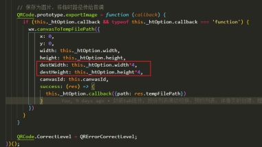

# 微信小程序

### 页面的生命周期

onLoad----监听页面的加载

onReady---监听页面初次渲染完成

onShow---监听页面显示

onHide---监听页面隐藏

onUnload---监听页面加载

 

### 组件的生命周期

created组件实例化，但节点树还未导出，因此这时不能用setData

attached节点完成，可以用setData渲染节点，但无法操作节点

ready组件布局完成，这时可以获取节点信息，也可以操作节点

moved组件实例被转移到树的另一个位置

detached组件实例从节点树中移除

小程序中只有组件才有methods，在page里的方法全写在onload中。都有data


### hidden控制组件不生效

hidden控制组件不生效，wx:if可以，如果要使用hidden隐藏组件，需要在组件再嵌套一层在外层使用hidden


### navigateTo

**navigateTo跳转页面会把传过去的数据默认转成字符串--需要手动转换数据格式**

**使用wx:navigateTo 这个api的时候，注意？号后面的第一个参数如果过长，可能后面的带参丢失的情况**

这种路径参数传递前先编下码，使用encodeURIComponent先编码，之后使decodeURIComponent

解码


### 带参传值获取属性值

一般绑定的bindchange事件的传值和input组件的value值都是使用e.detail.value

使用自定义属性传值data-index = “1”（在标签中绑定）使用e.currentTarget.dataset[‘index’]

通过跳转传值value的，需要在onLoad周期函数 options.value


### 父子组件之间的传值

#### 父传子

在父组件中 :

绑定子组件current={{当前组件的变量current}}

绑定子组件dataLogs={{当前组件的变量logs}}

```html
 <main dataLogs="{{logs}}" current="{{current}}" bind:myevent="onMyevent"></main>
```


子组件中:

在properties中定义父组件传过来的变量current dataLogs ，其中observers为观察当前变量变化时出发方法

```javascript
Component({
  properties: {
    // 这里定义了innerText属性，属性值可以在组件使用时指定
    dataLogs: {
      type: Array,
      value: [],
    },
    current: {
      type: Number,
      value:0,
      observers:function(newval,oldval,){
        console.log(newval + "current")
      }
    }
  },
  data: {
  },
  methods: {
}
})
```


#### 子传父

**在父组件中** :

使用bind：子组件自定义方法myevent=”当前组件中的方法onMyevent”

```html
<main dataLogs="{{logs}}" current="{{current}}" bind:myevent="onMyevent"></main>
```


调用子组件传过来的参数使用，e.detail.子组件传的参数名

```javascript
Page({
  data: {
    current: 0,
    logs: []
  },
  onLoad: function () {
  onMyevent:function(e){
    this.setData({
      current:e.detail.current
    })
  }
})
```


**子组件中** :

子组件中的change方法，调用this.triggerEvent(上面在子组件自定义方法myevent，{参数名:当前组件的变量})

```javascript
Component({
  properties: {
  },
  data: {
    swiper_current: 0,
  },
 
  methods: {
    onSlideChangeEnd:function(e){
      this.setData({
        swiper_current: e.detail.current
      })
      this.change()
      // console.log(this.data.swiper_current)
    },
    change:function(){
      this.triggerEvent('myevent', { current: this.data.swiper_current});
    },
})
```


### 向绑定的方法传参

当前页面

标签中自定义   data-变量名={{参数}}   向getDetail方法传参

```html
<view wx:for="{{imgUrl}}" wx:key="index" bindtap="getDetail" data-item="{{item}}" data-index="{{index}}">
  <text>第{{index}}</text>
  <image class="img-style" src="{{item}}" mode="" ></image>
</view>
```


#### **获取自定义变量--参数**: 

getDetail方法中 e.currentTager.dataset[”参数名”]


#### **页面跳转+传参（wx.navgateTo不能跳转到tabber页面）**:

传参:  路径后面 + ?data（变量名）= value


#### **为避免带参的参数中存在 ？ ,会出现参数丢失的情况**:

**解决方案：**这种路径参数传递前先编下码，使用encodeURIComponent先编码，之后使decodeURIComponent解码，否则会出现丢字的情况例 如：“&”后面的字会丢失


```javascript
Component({
  properties: {
  },
  data: {
    imgUrl:[],
  },
  methods: {
    // 这里是一个自定义方法
    customMethod: function(){},
    getDetail(e){
      console.log(e.currentTarget.dataset['index'])
      wx.navigateTo({
      url: `../../pages/pages/page${e.currentTarget.dataset['index']+1}/index?data=${e.currentTarget.dataset['item']}`
      })
    }
  }
})
```


**目标页面**

跳转到目标页面中使用在options参数中获取 options.data

```javascript
onLoad: function (options) {
    console.log(options)
    this.setData({
      url:options.data
    })
  },
```


### 组件的使用

#### 滚动组件scroll-view  (列表页的加载更多)

##### 横向滚动使用：

```html
<scroll-view scroll-x="true" style=" white-space: nowrap; display: flex">
    <view wx:for="{{logs}}" wx:key="index" class="scroll-list {{current == index  ? 'border-color':''}}" bindtap="getDetail" data-item="{{index}}">第{{index + 1}}次登陆</view>
  </scroll-view>
```

##### 竖向滚动使用（实现分页加载）

滚动组件中flex布局不生效，需要在scroll-view内嵌套一层view标签在这个标签再使用display:flex使用flex布局

**常用于设置成垂直布局，进行下拉加载，到达底部触发bindscrolltolower事件，配合防抖进行分页加载更多**


wxml: (如果是在scroll-view使用flex：1的话也需要添加height：100%,否则无法下拉滚动)

```html
<view class="container-wrap">
<scroll-view scroll-y class="content" bindscrolltolower="loadmoreDebounce" wx:if="{{!noData}}">
<view wx:for="{{listData}}" wx:key="index" bindtap="getToDetail" data-id="{{item.id}}"> listData遍历出来的每个数据列表的布局 </view>
<view wx:if="{{noMore}}">没有更多了呦，亲！ </view>
</scroll-view>
<NoData wx:else>（此处为没有内容而显示的组件）</NoData>
</view>
```

wxss:

```css
.container-wrap {
   height: 100vh;
   display: flex;
   flex-direction: column;
}
.content {
   flex: 1;
   box-sizing: border-box;
   padding: 30rpx 30rpx;
   height: 100%;
   overflow: hidden;
}
```

js:

```javascript
import { debounce } from "../../utils/basics";//引入防抖方法
Page({
  data: {
params: {
         page: 1,
         pageSize: 10,
},
}
...
...
//获取调用接口数据
getListData(this.data.params){...},
// 防抖加载更多
  loadmoreDebounce: debounce(function () {
      if (this.data.noMore) {
        return;
      }
      let page = this.data.params.page;
      this.setData({
        "params.page": page + 1,
      });
      this.getListData();
    }, 1000),
  },
})
```

防抖方法--->  basics.js

```javascript
/** 
 * 防抖函数
 * @param {Function} fn 
 * @param {Number} interval 
 */
export function debounce(fn, interval) {
  var timer;
  var count = 0;
  var gapTime = interval || 1000; //间隔时间， 如果interval不传，则默认是1000
  return function () {
    clearTimeout(timer);
    var context = this; //保存此处的arguments，因为setTimeout是全局，arguments不是防抖函数需要的
    var args = arguments;
    if (count > 0) {
      timer = setTimeout(function () {
        fn.call(context, ...args);
      }, gapTime);
    } else {
      count++;
      fn.call(context, ...args);
    }
  };
}
```

上面的防抖为先触发式的防抖，因为运用在下拉刷新加载，我们在第一次触发执行事件的时候就不该延时去调用方法，连续第二次的时候才触发防抖的功能


节流分页加载：

其实这里也可以通过一个loading的字段来进行节流控制，当在触发加载的时候，loading为true，然后在触发加载的方法最上面加上，一个对loading的判断，为true则return，但接口正常返回的时候，loading置为false（当然你也可以用一个节流函数，但是直接用字段的话会更方便简洁）


##### 节流和防抖都是闭包的运用场景，而节流和防抖的运用场景又有哪些呢

 

防抖debounce：

1.search搜索联想，用户在不断输入值时，用防抖来节约请求资源。

2.频繁操作点赞和取消点赞，因此需要获取最后一次操作结果并发送给服务器

 

节流throttle：

1.鼠标不断点击触发，mousedown(单位时间内只触发一次)

2.window触发resize的时候，不断的调整浏览器窗口大小会不断的触发这个事件，用防抖来让其只触发一次


#### 轮播组件swiper

```html
<swiper class="swiper-style" current="{{current}}" indicator-dots="true"  indicator-active-color="#000"  autoplay="true" interval="5000" duration="500" bindchange="onSlideChangeEnd">
  <swiper-item class="swiper-style" wx:for="{{dataLogs}}" wx:key="index" style="width: 100%">
    <view class="center">{{item}}</view>
  </swiper-item>
</swiper>
```

##### 禁止用户手动滑动

hxml:

```html
<swiper-item catchtouchmove="stopTouchMove"></swiper-item>
```

按需禁止：

```html
<swiper-item catchtouchmove="{{data.items.length===1? 'forbid' : ''}}"></swiper-item>
```

js:

```javascript
stopTouchMove: function() { return false; }
```


#### video组件

**video组件默认为inline-block,存在默认边距，若要去除video的css样式属性需要设置display:block**

```html
<video  bindplay="play" bindpause="pause" id="video" src="{{item}}" autoplay="{{true}}" show-fullscreen-btn="{{true}}" show-play-btn="{{true}}" controls="{{true}}" enable-progress-gesture="{{false}}" />
```

wx.createVideoContext的使用：

wx.createVideoContext(string id, Object this)： wx.createVideoContext(“video”,this)获取id为video的实例，然后调用实例方法pause、play等自定义控制视频的播放和暂停

bindplay、bindpause属性播放和暂停的时候触发

 

#### input组件

##### 左右文字对其上下居中的问题

需要使用基线中心线对齐，另外设置高度的同时需要覆盖min-height的高度


##### !!!注意：

在ios9.+的版本上，遇到了一个问题。在键盘弹出的时候，快速滚动页面，输入的内容或input提示语会错位。且有时无法恢复到原有位置。当然，**前提是你这个页面是超过一屏需要滚动的时候**

1. 页面可通过样式的滚动（overflow-y: auto）来写，但是不要用 -webkit-overflow-scrolling: touch;

2. 页面用scroll-view,通过变量{sysScroll}来控制（使用过这个方法--可以解决）

```javascript
onfocus: function() {
    this.setData({sysScroll: false})
  },
onblur: function (e, param, inst) {
    this.setData({sysScroll: true})
  }
```


### this.setData方法

##### setData修改某对象的索引也是需要传字符串

例如： data:{ name:””}

```javascript
this.setData({
["data.name"] :  value
})
```


##### setData中给带下标的数组set数据

例如： array:[{name:””},{name:””},{name:””}]

###### 1.使用模板字符串

```javascript
This.setData({
[`array${index}.id`]:  value
})
```


###### 2.使用字符串的方法

```javascript
This.setData({
[“array” + index + ”.id”] :  value
})
```


### 保留上一个页面的数据，解决回退数据丢失

```javascript
let pages = getCurrentPages(); //获取当前页面js里面的pages里的所有信息。
let prevPage = pages[ pages.length - 2 ];  
 
//prevPage 是获取上一个页面的js里面的pages的所有信息。 -2 是上一个页面，-3是上上个页面以此类推。
 
prevPage.setData({  // 将我们想要传递的参数在这里直接setData。上个页面就会执行这里的操作。id为上一个页面的data，把当前页面的数据传值到上一个页面
    id:e.currentTarget.dataset.id,
})
//上一个页面内执行setData操作，将我们想要的信息保存住。当我们返回去的时候，页面已经处理完毕。
 
//最后就是返回上一个页面。
wx.navigateBack({
    delta: 1  // 返回上一级页面。
})
```


获取修改上一个页面的数据

```javascript
var pages = getCurrentPages();
var Page = pages[pages.length - 1]; //当前页
var prevPage = pages[pages.length - 2]; //上一个页面
var info = prevPage.data; //取上页data里的数据也可以修改
prevPage.setData({ 键: 值 }); //设置数据 
```


### 小程序生成附带自定义参数（或者跳转url）的二维码

<https://www.jianshu.com/p/e6021798cd40>

<https://github.com/dillonlfy/weapp-qrcode>

其中该代码保存下来的图片比较模糊，与设置生成的画布的大小有关系，所以这里需要修改他的源码，把保存的二维码的尺寸发放大为原来的n倍



(**!!!注意**:不知道为什么小程序的canvas组件在使用hidden隐藏后切换显示下一个的时候出现了闪动的问题，原因（触发重绘，可能二维码重新绘制缓慢），由于canvas的层级比较高，所以需要使用cover组件才能覆盖它)

**解决方案：**

如果有多个canvas，而且需要切换，使用swiper嵌套，使用轮播的形式切换然后设置切换时间为1毫秒，这样交互体验会好很多（避免了重绘，交互流畅），否则会出现切换缓慢闪动


### 解决checkbox组件不能直接调整大小，和监听复选框变化

给checkbox组件添加样式使用 transform: scale(0.5,0.5)   使用方法的方式调整大小

监听复选框的勾选：在checkbox组件外层添加checkbox-group组件添加bindchange方法

hxml:

```html
<checkbox-group class="checkbox"  bindchange="checkboxChange">
     <checkbox  value="是否阅读"  checked="{{checkbox}}"/>
 </checkbox-group>
```

js:

```javascript
checkboxChange: function (e) {
if (e.detail.value == "") {
     //未勾选
      this.setData({
        checkbox: false,
      });
} else {
       //已勾选
      this.setData({
        checkbox: true,
      });
    }
  }
```


### 我的常用布局及样式

#### 自定义行数css：

```css
white-space: normal;  //正常换行
overflow: hidden;
text-overflow: ellipsis;
display: -webkit-box;
-webkit-line-clamp: 2; //两行显示
-webkit-box-orient: vertical;
```


#### 自适应满屏

父级标签： height:100vh;   display: flex； flex-direction: column;

自适应子级： flex: 1


#### flex居中

flex的上下居中  align-items: center;     左右居中：justify-content:center


#### 两列从左到右水平、均分布局

```css
display: flex;
flex-wrap: wrap;
align-content: flex-start;
justify-content: space-between;
```


#### 瀑布流布局横向排序

##### 两列：（但这个方法需要给父盒子添加高度，如果需要下拉加载，此方法不可行）

父盒子

```css
 display: flex;
 flex-flow: column wrap;
```


列表---子元素

添加伪元素选择器

```css
.item:nth-child(2n) { order: 2; }
.item:nth-child(2n+1) { order: 1; }
```


三列：

列表---子元素

添加伪元素选择器

```css
.item:nth-child(3n+1) { order: 1; }
.item:nth-child(3n+2) { order: 2; }
.item:nth-child(3n)   { order: 3; }
```


##### display: flex; flex-direction: column;数据分组 （下拉加载可行）

但要这样实现多列好像需要设置高度，这里确定这个高度比较难，使用flex的话考虑使用数据分组，两列的话奇数偶数分别存储，放到对应列渲染，但需要实现真正的瀑布流还需要计算高度，哪边低优先排到哪一边（目前在小程序上使用过这个方法，但没计算高度，无限流，如果小程序上使用一组计算高度，一组真正的显示，需要每次加载计算两列的高度再进行排分，这样需要花费的计算时间，可能会比较大。）

(这里如果后端没有返回高度的话，可以自定义一组高度的数据，然后通过随机函数给各个元素设置高度，模拟瀑布流，然后图片取中自适应即可)

css： 

```css
display:flex; 
flex-flow: column wrap;
```

然后两列都使用这个类，父盒子可以使用display: flex;布局然后两列加flex：1在第一列加margin边距即可


##### column（下拉加载可行，当排序时从上往下排序）

使用**column也可以实现多列**，这个的话虽然不用定高度，但最大的缺点是**排序只能是从上往下**

父盒子：

```css
column-count: 设置共有几列
column-width: 设置每列宽度，列数由总宽度与每列宽度计算得出
column-gap: 设置列与列之间的间距
```

如果瀑布流的每个元素的高度不定使用自适应的方式，那么如果盒子没有预先设置高度或者使用占位符，在加载的时候会出现抖动的现象


### 使用wxs进行时间戳格式化（类似于vue的fillter函数）

wxml:

```html
<view>{{dateUtil.dateFormat(time,'YYYY-MM-dd hh:mm:ss')}}<view>

<wxs module='dateUtil' src='../util/util.wxs'></wxs>
```


util.wxs:

```javascript
/**
 * 
 * @param n 
 */
var formatNumber = function (n) {
  n = n.toString();
  return n[1] ? n : "0" + n;
};
var regYear = getRegExp("(y+)", "i");

/**
 * 
 * @param {Number} timestamp 时间戳
 * @param {String} format 格式 
 * @param {Boolean} flag  默认传入时间戳精确到毫秒  13位的时间戳精确到毫秒,如果传入的时间戳为10位精确到秒flag需为true需乘1000
 */
var dateFormat = function (timestamp, format, flag) {
  var ms = flag === true ? 1000 : 1
  if (!format) {
    format = "yyyy-MM-dd hh:mm:ss";
  }
  timestamp = parseInt(timestamp) * ms;
  var realDate = getDate(timestamp);
  function timeFormat(num) {
    return num < 10 ? "0" + num : num;
  }
  var date = [
    ["M+", timeFormat(realDate.getMonth() + 1)],
    ["d+", timeFormat(realDate.getDate())],
    ["h+", timeFormat(realDate.getHours())],
    ["m+", timeFormat(realDate.getMinutes())],
    ["s+", timeFormat(realDate.getSeconds())],
    ["q+", Math.floor((realDate.getMonth() + 3) / 3)],
    ["S+", realDate.getMilliseconds()],
  ];
  var reg1 = regYear.exec(format);
  // console.log(reg1[0]);
  if (reg1) {
    format = format.replace(
      reg1[1],
      (realDate.getFullYear() + "").substring(4 - reg1[1].length)
    );
  }
  for (var i = 0; i < date.length; i++) {
    var k = date[i][0];
    var v = date[i][1];

    var reg2 = getRegExp("(" + k + ")").exec(format);
    if (reg2) {
      format = format.replace(
        reg2[1],
        reg2[1].length == 1 ? v : ("00" + v).substring(("" + v).length)
      );
    }
  }
  return format;
};

module.exports = {
  dateFormat: dateFormat,
};

```


### 开屏动画，出现抖动的情况

**原因**：是因为没有启动硬件加速的原因
**解决方案**:启动硬件加速，方式有：translate3D，translateZ，transform

```css
.css{
-webkit-transform: translate3d(0,0,0);
-moz-transform: translate3d(0,0,0);
-ms-transform: translate3d(0,0,0);
transform: translate3d(0,0,0);
}
```

### 重写路由跳转方法，添加回调cb

```javascript
let router = function (cb) {
    init()
    let obj = {
        navigateTo: wx.navigateTo,
        switchTab: wx.switchTab,
        reLaunch: wx.reLaunch,
        redirectTo: wx.redirectTo,
        navigateBack: wx.navigateBack
         }
    for(let key in obj) {
        wx[key] = async function (params) {
            let fun = obj[key]
            await fun(params)
            let url =  await getCurrentPages()
            await cb({
                url,
                routerMethod:key,
                to: params
            })
        }
    }
} 
// 重新设置wx的路由跳转方法
function init (){
    let obj = {
        navigateTo: wx.navigateTo,
        switchTab: wx.switchTab,
        reLaunch: wx.reLaunch,
        redirectTo: wx.redirectTo,
        navigateBack: wx.navigateBack
      }
      for(let key in obj) {
        Object.defineProperty(wx, key,{
          get: function (){
            return obj[key]
          },
          set: function (val){
            obj[key] = val
          }
        })
      }
}
module.exports = router
```

